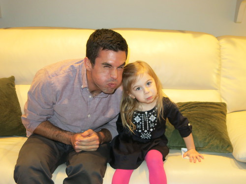

# Jack Reilly Homepage

As of October 2014, I have completed my PhD from UC Berkeley in Civil Systems Engineering, and now work at Google.

My contact is `<`firstname`>` d `<`lastname`>` at gmail dot com.

## Papers

* **Thesis**: Security of Freeway Traffic Systems: A Distributed Optimal Control Approach [pdf](papers/thesis.pdf)

* Reilly, J., Martin, S., Payer, M., Song, D., & Bayen, A. M. (2014). **On Cybersecurity of Freeway Control Systems: Analysis of Coordinated Ramp Metering Attacks**. Transportation Research Part B - Methodological (under Review). [pdf](papers/security.pdf) 

* Reilly, J., & Bayen, A. M. (2014). **Distributed Optimization for Shared State Systems: Applications to Decentralized Freeway Control via Subnetwork Splitting**. IEEE Transactions on Intelligent Transportation Systems (under Review). [pdf](papers/distributed.pdf)

* Reilly, J., Samaranayake, S., Delle Monache, M. L., Krichene, W., Goatin, P., & Bayen, A. M. (2014). **Adjoint-based optimization on a network of discretized scalar conservation law PDEs with applications to coordinated ramp metering**. Journal of Optimization Theory and Applications (under Review). [pdf](papers/adjoint.pdf)

* Reilly, J., Dashti, S., Ervasti, M., Bray, J. D., Glaser, S. D., & Bayen, A. M. (2013). **Mobile Phones as Seismologic Sensors: Automating Data Extraction for the iShake System**. IEEE Transactions on Automation Science and Engineering, 10(2), 242–251. doi:10.1109/TASE.2013.2245121 [pdf](papers/ishake.pdf)

* Reilly, J., Krichene, W., Amin, S., & Bayen, A. M. (2012). **Optimization-based Framework for Rerouting a Subset of Users with Mixed Lagrangian-Eulerian Demand**. Manuscript, 1–19. [pdf](papers/reroutes.pdf)

* Delle Monache, M. L., Reilly, J., Samaranayake, S., Krichene, W., Goatin, P., & Bayen, A. M. (2014). **A PDE-ODE model for a junction with ramp buffer**. SIAM Journal on Applied Mathematics, 74(1), 22–39. [pdf](papers/pde-ode.pdf)

* Hunter, T., Hofleitner, A., Reilly, J., Krichene, W., Thai, J., Anastasios Kouvelas, … Bayen, A. (2013). **Arriving on time : estimating travel time distributions on large-scale road networks**. [pdf](papers/bestroute.pdf)

* Krichene, W., Reilly, J., Amin, S., & Bayen, A. M. (2014). **Stackelberg Routing on Parallel Networks With Horizontal Queues**. Automatic Control, IEEE Transactions on, 59(3), 714–727. doi:10.1109/TAC.2013.2289709 [pdf](papers/stackelberg.pdf)

* Krichene, W., Reilly, J., Amin, S., & Bayen, A. (2012). **On the characterization and computation of Nash equilibria on parallel networks with horizontal queues**. In 2012 IEEE 51st IEEE Conference on Decision and Control (CDC) (pp. 7119–7125). Ieee. doi:10.1109/CDC.2012.6426543 [pdf](papers/nash.pdf)

## Presentations

* **Dissertation Talk**: UC Berkeley ITS Seminar, December 2014. [slides](https://docs.google.com/presentation/d/1ky6zX8DNAF5IeCo5PADSDWS2WflNqaPcGDdnGhn7xRY/pub?start=false&loop=false&delayms=3000&slide=id.g53838a5ef_0606) [pdf](presentations/dissertation-2014.pdf)

* **Tutorial Session on Discrete Adjoint Methods and Freeway Traffic Control**, European Control Conference, 2013, Zurich, Switzerland. [pdf](presentations/ecc-2013.pdf)

* **Finding Nash Equilibria in Horizontal Queueing Networks**, Conference on Decision and Control, 2012, Honolulu, Hawaii. [webpage](presentations/cdc-2012/index.html)

* **Cyber-security of Freeway Traffic Control Systems**, US-Korea Conference, August 2014, San Francisco, California. [pdf](presentations/ukc-2014.pdf)

## Awards

* **2014 Milton Pikarsky Award for Outstanding PhD Dissertation in Science and Technology**, Council of Universities Transportation Center, Washington DC.

## Projects

* **SmartRoads** - building a cyber-security aware traffic management system:
	* [Dramatic Video](https://www.youtube.com/watch?v=2B8zPl5Tdfs)
	* [Congestion-on-demand Demo](http://traffic.berkeley.edu/smartroads)
	* [Poster](projects/smart-america/poster.pdf)
	* [Paper](papers/security.pdf)
	* [Micro-simulations](https://www.youtube.com/watch?v=ofQlIO6GJVw)
	* [Code](https://github.com/jackdreilly/demo_rampmetering)
	* [Cal logo visual](https://www.youtube.com/watch?v=zPBFnORIL8s)

* **iShake** - crowdsourcing earthquake measurements using iPhones:
	* [Website](http://ishakeberkeley.appspot.com)
	* [Paper](papers/ishake.pdf)
	* [Accelerometer paper](http://www.earthquakespectra.org/doi/abs/10.1193/091711EQS229M)
	* [User studies paper](papers/ishake-user-studies.pdf)
	* [Code](https://github.com/jackdreilly/iShakeGCode)

## Personal

* [Old webpage](old-page/index.html)
* [QuikLyrics](http://quiklyrics.appspot.com)
* [Daft Punk Cover](https://www.youtube.com/watch?v=9t-WxbWQBgw)
* [The King](https://www.youtube.com/watch?v=Wb0Jmy-JYbA)