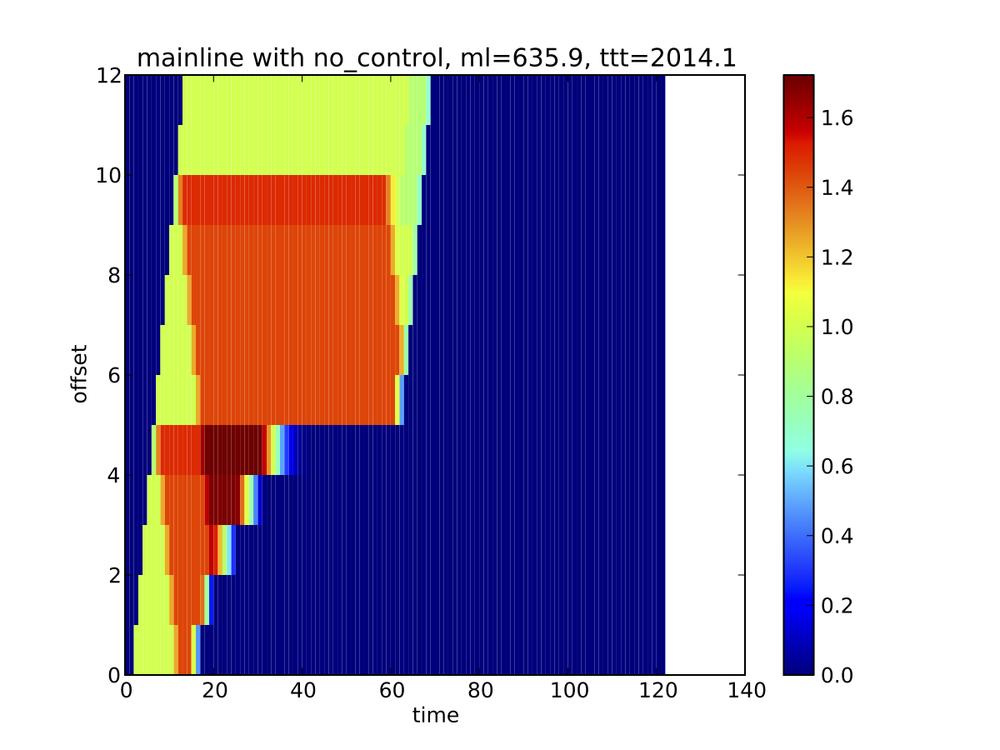
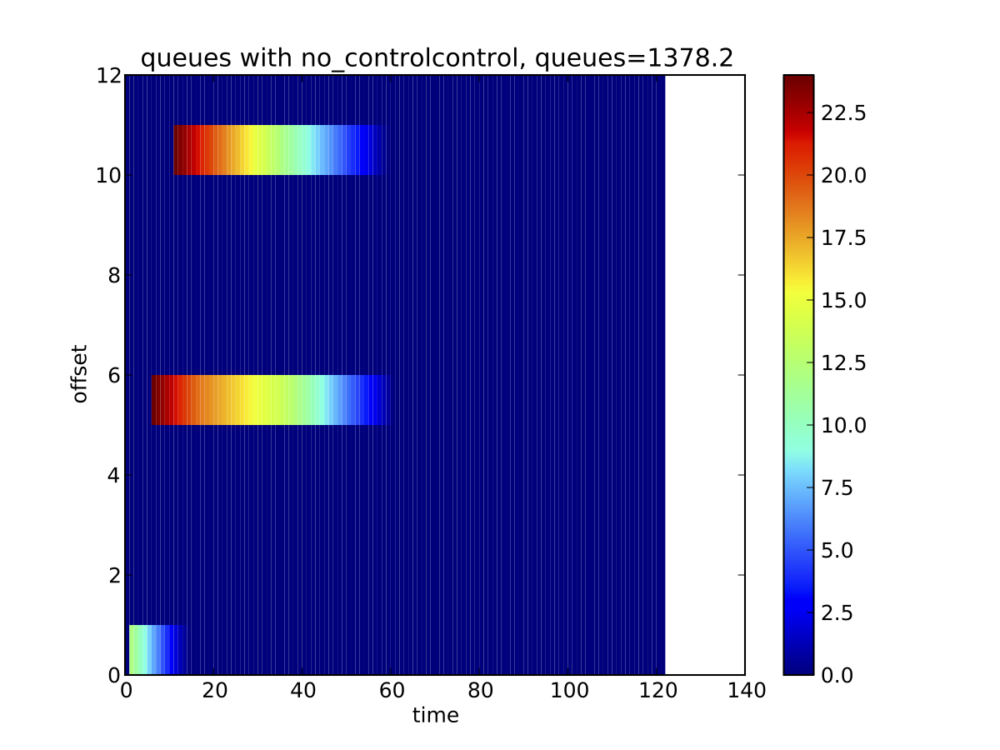
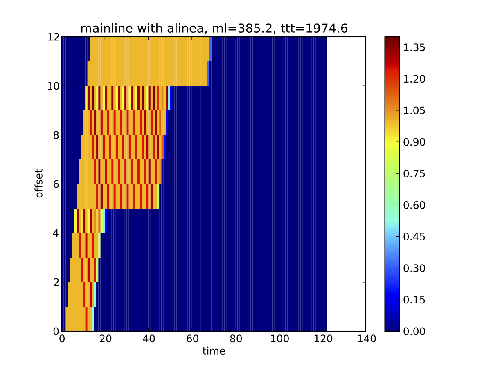
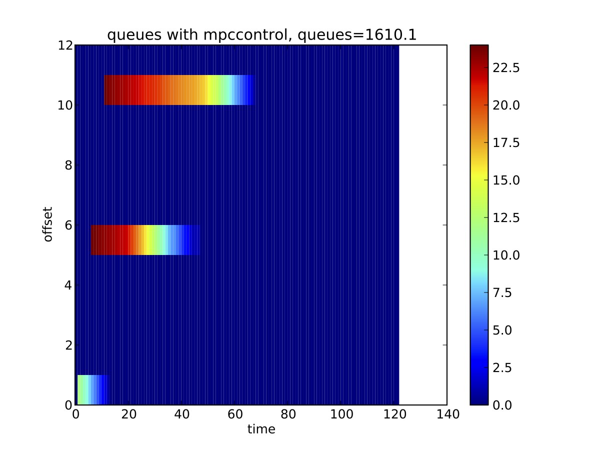

# Synthetic Network Simulations with Noise #

Jack Reilly
------

    
## Network ##

* Synthetic freeway network
* Fundamental diagrams have ~ 60 mph free flow, 60 mph congestion speed, 1 veh/ second capacity.
* 12 links (~ 6 miles)
* 120 timesteps (~ one hour)
* 3 onramps
* One demand "impulse" per onramp at different times
* Total travel time units in vehicle minutes.
* Density units in vehicles / mile.
* Queue units in vehicles.

## Simulation environment ##

* Beats was used as the "real world", and was responsible for keeping track of real state, forward dynamics, and dispatching control
* Different control schemes were tried
    * No control
    * Adjoint
       * At regular update periods, Beats passes estimated current densities, boundary fluxes, and split ratios to the adjoint controller to make policies
    * Alinea
      * Every timestep, Beats updates Alinea with estimated current densities and model parameters.
* Control schemes may be passed perfect information on model/initial conditions/ boundary conditions, or noisy estimates (artificial noise added by Beats).

## Noise ##

Noise was modeled by taking the true state (as seen by Beats), and perturbing the state as passed to the control schemes (both Adjoint and Alinea). If noise was "x %", then the value v' as seen by a control scheme is:
  v' = v * (1 + 2 * x / 100 * (rand(0,1) - .5))
where v is the true value.

* Initial condition noise
    * changes initial densities and queue lengths
    * affects both adjoint and alinea
* Model noise
    * changes fundamental diagram properties and max ramp flux rates
    * affects both adjoint and alinea
* Boundary condition noise
    * changes the split ratios and onramp influxes for all time steps
    * Only affects adjoint.

## Results ##

### Summary ###

* Adjoint and Alinea show robustness to noise, even to extreme noise levels (20%)
* Slight degradation in performance for noise levels at 5%
* Adjoint and Alinea seemed to be roughly on par for this synthetic network, for all noise levels considered.
* Results with real data on a real network may prove to be more enlightening, but these preliminary results show both controllers to be rather robust to model/data noise.

### No Control ###

### No Noise ###

* Adjoint

* Alinea

### 5 % Noise ###

* Adjoint

* Alinea

### 20 % Noise ###

* Adjoint

* Alinea

